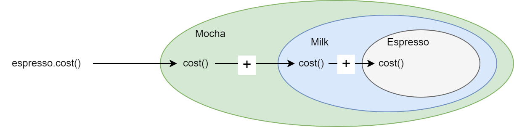

# Decorator Design Pattern

## Example to Build
   - You want to make Beverage and add condiments to it as additional
   - Now you want to add functionality to the Beverage -> condiments
   - and they may change from order to another problem

## Design


### Design patterns
   - **Decorator design pattern**: attaches additional responsibilities to an object dynamically. Decorators provide a flexible alternative to subclassing for extending functionality.
   - That is what we will do
     - Make interface or abstruct class (supertype) for beverage `Beverage`
     - the main beverages like (Esspresso, Deca, ..) will implement the Beverage
     - and make a (supertype) for condiments this is supertype implements Beverage
     - this supertype will be the decorator that will contains a reference for `Beverage` that the decorator wrap it
     - the condiment will implement the decorator supertype
     - explain how to use
     ```java
        // the main Beverage
        Beverage espresso = new Espresso();
        // we decorate the espresso with Milk & mocha
        espresso = espresso(new Milk());
        espresso = espresso(new Mocka());
        // now when we get the cost we get the cost of the espresso.cost + milk.cost + mocha.cost
        // the cost is an abstruct method in the Beverage
        // decorator implements the cost like 
        // cost = beverage.cost + this.cost
        espresso.cost();
     ```
     
     - we here have add more functionality to the cost the cost not only get the cost of an item but all the components that have added to it

## Class Diagram


## OO principle
   - Classes should open for extension and closed for modification
   - This means:
     - the class can be extend easly (new behviors) by add new class for example, if requirements change we will make this extention
     - but this extension not by modifing the code like enter to a method and modify the code in it to meat the changes
     - Like we have saw in strategy pattern when we want to add new behavior we should implements a new class with the same supertype of the behavior that happends without changing the code like add new if/else in a method
   - this principle shouldn't be everywhere because it will add more complixity to the code 
   - We should use it with what varies or expected to varies

    


